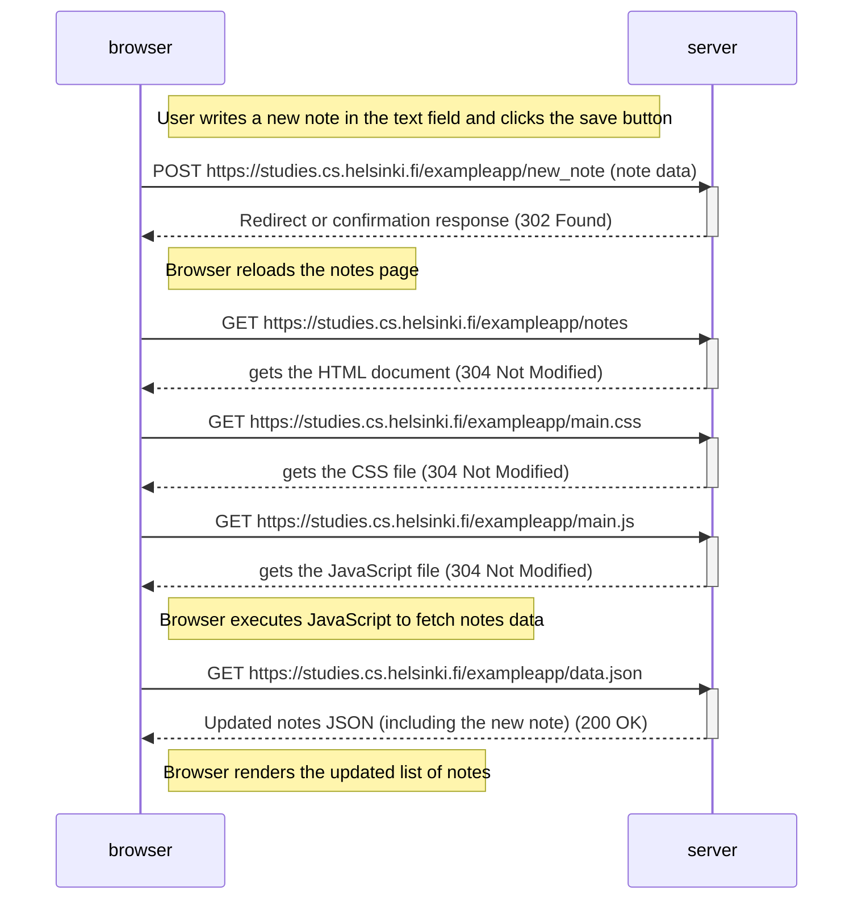

```mermaid
sequenceDiagram
    participant browser
    participant server

    Note right of browser: User writes a new note in the text field and clicks the save button

    browser->>server: POST https://studies.cs.helsinki.fi/exampleapp/new_note (note data)
    activate server
    server-->>browser: Redirect or confirmation response (302 Found)
    deactivate server

    Note right of browser: Browser reloads the notes page

    browser->>server: GET https://studies.cs.helsinki.fi/exampleapp/notes
    activate server
    server-->>browser: gets the HTML document (304 Not Modified)
    deactivate server

    browser->>server: GET https://studies.cs.helsinki.fi/exampleapp/main.css
    activate server
    server-->>browser: gets the CSS file (304 Not Modified)
    deactivate server

    browser->>server: GET https://studies.cs.helsinki.fi/exampleapp/main.js
    activate server
    server-->>browser: gets the JavaScript file (304 Not Modified)
    deactivate server

    Note right of browser: Browser executes JavaScript to fetch notes data

    browser->>server: GET https://studies.cs.helsinki.fi/exampleapp/data.json
    activate server
    server-->>browser: Updated notes JSON (including the new note) (200 OK)
    deactivate server

    Note right of browser: Browser renders the updated list of notes
```