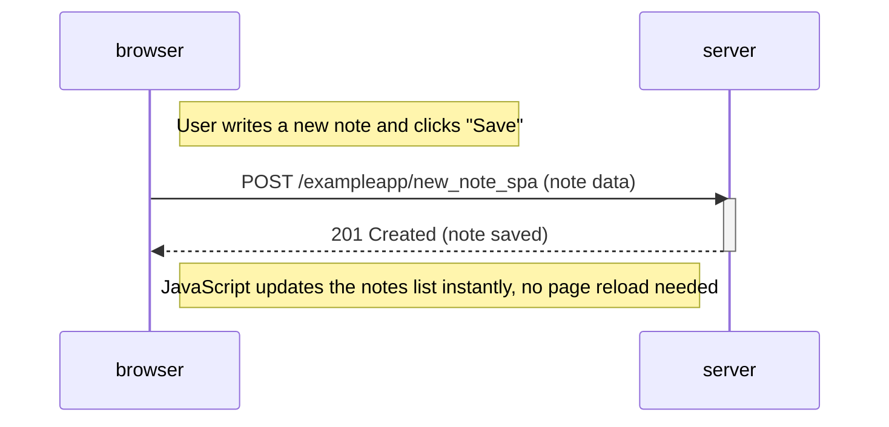

```mermaid
sequenceDiagram
    participant browser
    participant server

    Note right of browser: User writes a new note and clicks "Save"

    browser->>server: POST /exampleapp/new_note_spa (note data)
    activate server
    server-->>browser: 201 Created (note saved)
    deactivate server

    Note right of browser: JavaScript updates the notes list instantly, no page reload needed
```